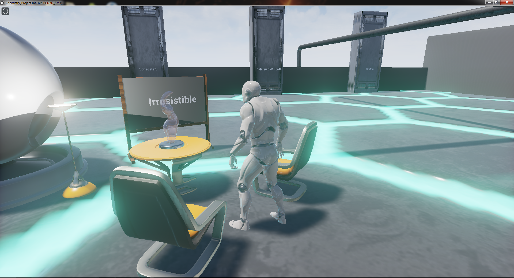

# NanoGallery

NanoGallery is 3D computer game, which teaches about nanoparticles and their purpose. This game has been awarded and exhibited on Collegium Maius at the Jagiellonian University.

### Screenshots:

### Estimated system requirements
#### Minimal:
* `OS:` Windows 7 64bit or Windows 10 64bit
* `RAM:` 4GB

#### Recommended:
* `OS:` Windows 7 64bit or Windows 10 64bit
* `RAM:` more than 4GB
* `GPU:` Intel HD

---

### Controls
#### Key bindings:
* `WASD` - control player's character
* `SPACE` - jump
* `Mouse` - control player's camera

After you enter a MainLevel you have to click a left mouse button on screen to take control over player's camera.

---

### Authors:
* Szymon Kocur (gameplay)
* Paweł Tyrna (3D models and descriptions)
* Dominik Schabikowski (music)

### Important dates:
* 05 April 2016 - start
* 09 June 2016 - release
